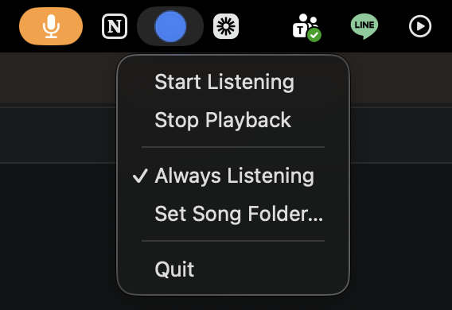

# Thai Song Player 🎵

[](https://github.com/punn-ce-spsm/thai-song-player/actions/workflows/ci.yml)

A macOS menu-bar app: press a global hotkey, **speak a Thai song name**, and it plays the matching local audio file. Speech-to-text runs **locally** with OpenAI Whisper — no audio ever leaves your machine.

> _แอปบนแถบเมนู macOS: กดปุ่มลัด พูดชื่อเพลงภาษาไทย แล้วแอปจะเล่นไฟล์เพลงในเครื่องที่ตรงกัน — ประมวลผลเสียงในเครื่องทั้งหมด_



## Install

Requires **macOS** and **Python 3.10+**.

```bash
git clone https://github.com/punn-ce-spsm/thai-song-player
cd thai-song-player
make install
make run
```

That's it — `make install` builds an isolated virtualenv and installs everything. No Homebrew or ffmpeg required (audio is fed to Whisper as a numpy array).

> On first launch, the app downloads the Whisper `base` model (~140 MB) from OpenAI's CDN. This is the only network access the app makes.

## Permissions

macOS will prompt for two permissions. Grant both under **System Settings → Privacy & Security**:

| Permission | Why it's needed |
|---|---|
| **Microphone** | Record your voice to recognise the song name |
| **Accessibility** | Register the global hotkey (works while other apps are focused) |

If the hotkey does nothing, add your terminal app (Terminal/iTerm2) to the **Accessibility** list.

## Usage

- The menu-bar icon shows state: 🟢 idle · 🔴 listening · 🟠 processing · 🔵 playing.
- Press **⌘⇧Space** (default), then say the song name in Thai. Recording stops automatically on silence or after 5 seconds.
- Menu → **Set Song Folder…** to choose your music folder. Supported: `.mp3 .wav .m4a .flac .aac .ogg .opus`.
- Menu → **Always Listening** for hands-free continuous mode.

## Configuration

On first launch the app prompts for a song folder and writes `config.json` (git-ignored, local only). To start from the template:

```bash
cp config.example.json config.json
```

| Key | Meaning |
|---|---|
| `song_folder` | Absolute path to your music folder |
| `threshold` | Match strictness 0–100 (higher = stricter). Default 70 |
| `hotkey` | pynput hotkey string, e.g. `<cmd>+<shift>+<space>` |
| `always_listening` | Continuous listening mode |

**Optional name mapping:** if your filenames differ from the spoken names, copy `songs.example.json` to `songs.json` and map `spoken Thai → filename`.

## Security & Privacy

- **No data collection.** The app collects, stores, logs, and transmits **nothing**. Microphone audio is processed in memory and discarded after each recognition; it is never written to disk or sent anywhere. There is no telemetry or analytics.
- **Everything runs locally.** Recording, transcription (Whisper), matching, and playback all happen on your machine.
- **Only network call:** the one-time Whisper `base` model download on first run (from OpenAI's CDN, integrity-checked via SHA-256).
- **Always-listening mode** processes ambient audio continuously, but the same way — locally and ephemerally, with nothing retained. Leave it off if others are nearby and you'd rather not have the mic open.
- **Least privilege:** the app uses exactly two permissions (Microphone, Accessibility), each explained above; macOS mediates your consent.
- **Hardening:** notification text is passed to `osascript` as arguments (no AppleScript injection); the song folder and `songs.json` paths are containment-checked (no path traversal, no symlink escape); temp files use random names.

## Architecture

```
hotkey ─▶ recorder ─▶ recognizer ─▶ matcher ─▶ player
         (mic→numpy)  (Whisper TH)   (thefuzz)   (afplay)
```

| Module | Responsibility |
|---|---|
| `app.py` | Menu-bar UI, thread-safe state machine, pipeline orchestration |
| `recorder.py` | Mic capture → float32 numpy array with silence detection |
| `recognizer.py` | Whisper Thai speech-to-text (local `base` model) |
| `matcher.py` | Fuzzy song-name matching + safe library loading |
| `player.py` | Playback via `afplay`, format detection via `mutagen` |

## Development

```bash
make test    # run unit tests
make lint    # ruff
make audit   # pip-audit dependency scan
make clean   # remove venv & caches
```

## Troubleshooting

| Problem | Fix |
|---|---|
| Hotkey does nothing | Add your terminal to System Settings → Accessibility |
| "ไมโครโฟนถูกปฏิเสธ" | Add your terminal to System Settings → Microphone |
| Song not found despite clear speech | Lower `threshold`, or add a `songs.json` mapping |
| First listen is slow | Normal — Whisper loads on first use; later listens are fast |

## License

[MIT](LICENSE) © Punnawich Vanadilok

Runtime dependencies carry their own licenses (including GPL/LGPL components) — see
[THIRD_PARTY_LICENSES.md](THIRD_PARTY_LICENSES.md). They are installed via `pip` and
not redistributed here, so this project's source stays MIT.
